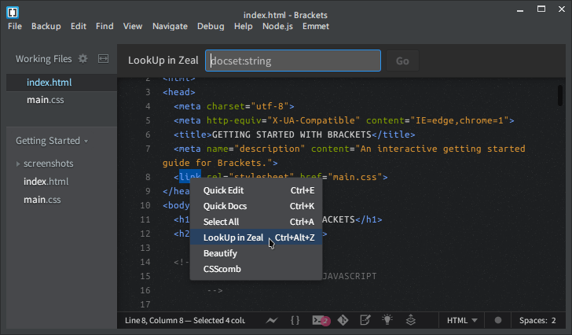

## Zeal integration for Brackets

> A [Brackets](https://github.com/adobe/brackets) extension that allows look up the word under the current cursor or any selected text in [Zeal](http://zealdocs.org/) (simple offline api documentation browser inspired by OSX app Dash, available for Linux and Windows)

#### Installation

* Select **File > Extension Manager...** (or click the "brick" icon in the toolbar).
* Search for **"Zeal integration for Brackets"** and click the **Install** button.
* **Windows users**: [Add](https://www.google.com/search?q=How+to+set+the+path+and+environment+variables+in+Windows) Zeal installation directory to the system "PATH" environment variable.

#### How To Use
- Use <kbd>Ctrl+Alt+Z</kbd> while your cursor is on a word or when you select the text.
- Right-click on a word or selected text and go **"LookUp in Zeal"**.
- Hit <kbd>Ctrl+Shift+Z</kbd> to open modal bar for custom search.

#### Roadmap
- *Language mapping settings*.

#### Changelog
See [CHANGELOG.md](CHANGELOG.md) for details.

#### License
[The MIT License (MIT)](LICENSE)
